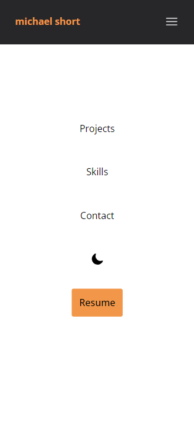
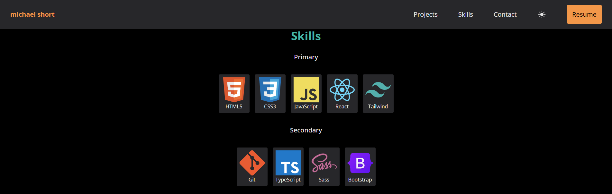
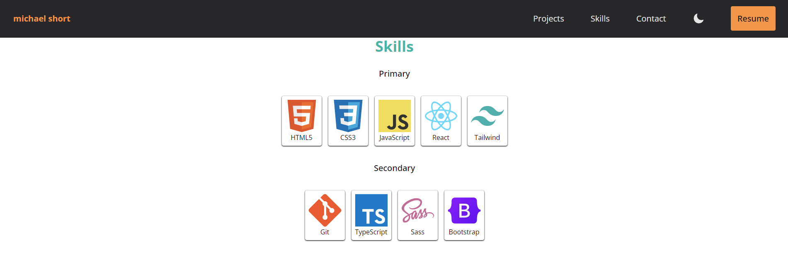

# Portfolio Website

### Table of Contents

-   [About](#about)
    -   [Tools](#tools)
    -   [Design](#design)
    -   [Challenges](#challenges)
    -   [What I Learned](#what-i-learned)
-   [Features](#features)
    -   [Mobile Navigation](#mobile-navigation)
    -   [Light/Dark Theme](#lightdark-theme)
-   [Getting Started](#getting-started)
    -   [Prerequisites](#prerequisites)
    -   [Installation](#installation)
-   [Contact](#contact)

# About

I made my portfolio website with priority on responsiveness and design. I made sure that it responds to devices of all sizes using media queries via Tailwind utility classes. It also has a light/dark theme toggle and uses local storage to save theme preference.


### Tools

&nbsp;
&nbsp;


### Design

I spent a lot of time on the design as I wanted something that looked simple yet polished. I had looked at examples of online portfolios and found one with a layout that I liked so I used that as a reference. For the color scheme I used Crunchyroll. I think they have an awesome website so I thought why not use their color palette rather than make my own.

### Challenges

The design took much longer than I expected despite it being a simple, single-page website. I wanted everything to look perfect. The hovers, the spacing, transitions, cards, buttons, mobile navigation, making it adapt and lay out correctly on different screen sizes, etc. I feel much more confident with Tailwind after this project and it has really made styling more efficient and organized for me.

One challenge was getting the mobile navigation menu to display exactly as I wanted. I used absolute positioning and hid the overflow-y to prevent scrolling so that it takes up the entire screen on mobile devices. This led to a bug where if the menu was opened, and the viewport changed >= 768px (for example, changing phone orientation), then it would be impossible to scroll the page without a refresh. I fixed this by adding an event listener to the window for resizing. This is basically a media query but in JavaScript.

```js
window.addEventListener('resize', () => {
	if (isMobileNavOpen && window.innerWidth >= 768) {
		document.body.style.overflowY = 'auto';
	}
});
```

Another challenge was my sticky header blocking content when the page was scrolled with a navigation link. To fix this, I added scroll-padding-top which is dynamically calculated based on the header's height. Then, this added to the top of the section that is scrolled to, pushing the content directly below the header and making it visible.

```js
const headerHeight = document.querySelector('header').offsetHeight;

document.documentElement.style.setProperty(
	'--scroll-padding',
	`${headerHeight}px`,
);
```

For the contact form, I haven't studied back-end (yet) so I ended up using Formspree. It was very easy as I only had to copy and paste the form endpoint that Formspree provided. This allowed me to design the form however I wanted to match my theme.

### What I Learned

This was my first time using local storage to save data on the user's preference for the theme. When the page is refreshed, the light and dark theme should render based off the previous visit rather than defaulting to one.

I worked a lot with conditional rendering with some elements having a default display of none, but when some condition is met they will render. For example, when hovering over the projects the buttons will appear.

As for more specifics, I learned about scroll-padding, window.scroll(), the window resize event listener, overflow-y, and using a boolean toggle for the mobile navigation. I also feel more proficient with Tailwind, media queries, and the overall process of developing one component at a time, mobile-first.

Concepts learned/practiced:

-   responsive design
-   local storage
-   light/dark theme toggle
-   mobile navigation
-   event listeners, handlers, toggles

# Features

### Mobile Navigation




Features:

-   absolute positioning
-   hides overflow-y to take up entire screen
-   boolean toggle to render the menu
-   clicking the menu scrolls to top

### Light/Dark Theme




Features:

-   uses local storage to render previously set theme
-   header displays moon/sun depending on theme
-   toggles classList to add and remove class from root element

# Getting Started

### Prerequisites

To get the project running on your machine, you'll need to have the following installed:

-   [Node.js](https://nodejs.org/)
-   [npm](https://www.npmjs.com/) or [Yarn](https://yarnpkg.com/)

### Installation

1. Clone the repository to your local machine:

```
git clone https://github.com/mshortcodes/portfolio-website.git
```

2. Change into the project directory:

```
cd portfolio-website
```

3. Install dependencies using npm:

```
npm install
```

4. Run the development server:

```
npm run dev
```

# Contact

Michael Short - mshortcodes@gmail.com

Project link: https://www.mshort.dev/
